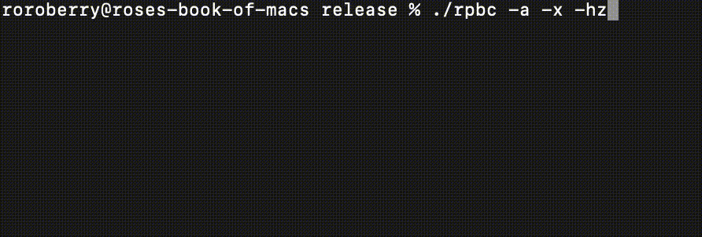

# Rose's Pitch-Based Controller
 This Rust CLI program takes stereo input (originating from a pairing homebrew program available in the *nds branch*) and translates it to key presses and mouse movement/clicks according to the DS input.

 

 ## Flags
 - ```-a```: Ommits list of input devices
-  ```-c```: Opens program in calibration mode.
- ```-sp```: Skips pitch detection step in calibration mode.
- ```-hz```: Shows detected frequency.
- ```-x```: Runs program without simulating key presses.

## Compiling
The computer program should be natively compilable using ```cargo build```. It's been tested on Apple Silicon.

## Rust Dependencies
- pitch-detector
- cpal
- json
- console
- rdev
- mouse_position